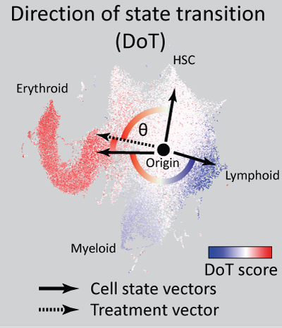

.. role:: pyth(code)
  :language: python

dotscore
========

dotscore is a python module created to enable easy computation of DoT-scores (Direction of Transition scores) as presented in Kucinski et al. 2020 (`link <https://www.embopress.org/doi/full/10.15252/embj.2020104983>`_).
DoT-score is method aiding interpretation of transcriptional changes (e.g. lists of differentially expressed genes) using scRNA-Seq landscapes as a reference. The module is built on top of the scanpy module (https://scanpy.readthedocs.io/en/stable/)

DoT-score concept
-----------------

In a scRNA-Seq landscape gene expression values can be scaled to a chosen point of origin. This creates a set of vectors connecting each cell to the point of origin - cell state vectors in the multidimensional gene expression space. 
Now consider a treatment (gene knockout, chemical perturbation etc.) to a given cell population followed by a transcriptomic readout. The changes in gene expression (e.g. log2(Fold Change) from differential expression) are also a vector - the positive and negative values indicating shifts in the many dimensions of gene expression space.

DoT-score computes how well the two vectors (cell state change and treatment change) are aligned and enable visualisation on the scRNA-Seq landscape.
A positive DoT-score for a cell on the landscape indicates that the treatment causes cells to shift towards that state (starting from the point of origin), while a negative DoT-score indicates a shift away from that state. We provide a diagram below to illustrate this concept and a concrete example here: examples/dotscore_example.ipynb

More specifically, DoT score (**s**) calculates the dot product (proportional to the angle) between the treatment vector and the vector of gene expression (scaled) for each cell on the landscape: **s** = **X** **v**, where **X** is a matrix cells x genes with scaled expression values and **v** is a vector of weights (e.g. log2(Fold Change) for each gene). 
To provide a measure of statistical significance, we simulate the DoT-score by randomly choosing weights and genes and computing a z-score.

Usage
-----

Dotscore uses AnnData objects as inputs. Core functions are listed below:

:pyth:`get_DoTscore` - calculating DoT-score for each cell, arguments:
  - :pyth:`adata` - an AnnData object
  - :pyth:`de` - pandas DataFrame, which contains one column with gene names and one column with weights (e.g. log2(Fold Change) coming from differential expression analysis)
  - :pyth:`allfolds` - numpy array or pandas Series, which contain a set of weights (e.g. log2FoldChanges) used for simulations. This is the background distribution of weights to be drawn from.
  - :pyth:`allgenes` - numpy array or pandas Series, which contains all gene names expressed in the assayed cell population, for instance if using log2FoldChange these are all genes used for differential expression analysis.
  - :pyth:`simno` - number of simulations to run for z-score estimation (if :pyth:`zscore` is :pyth:`True`)
  - :pyth:`id_col` - name of the column in de, which contains the gene names (default: "target")
  - :pyth:`weight_col` - name of the column in de, which contains the weights (default: "log2FoldChange")
    
    Returns: Pandas Series with the respective DoT-scores per cell.

:pyth:`custom_scale` - equivalent to the scaling function from the scanpy package, but allows scaling using a vector of chosen mean expression values - thus allowing choice of point of origin.
  - :pyth:`adata` - an AnnData object
  - :pyth:`mean` - numpy array with mean gene expression used for scaling. Needs to match the genes in the AnnData object. If None, the global mean will be used.

    Caution: The AnnData object is modified in place.

:pyth:`get_genescore_pergroup` - Computes the contributions coming from each gene, which when summed up generate the DoT-score. To help interpretation contributions are averages per group of cell specified (:pyth:`group` argument). This tool helps identifying the genes with the strongest influence on the DoT-score (positive or negative) in chosen areas of the scRNA-Seq landscape.
  - :pyth:`adata` - an AnnData object
  - :pyth:`de` - pandas DataFrame, which contains one column with gene names and one column with weights (e.g. log2(Fold Change) coming from differential expression analysis)
  - :pyth:`id_col` - name of the column in de, which contains the gene names (default: "target")
  - :pyth:`weight_col` - name of the column in de, which contains the weights (default: "log2FoldChange")
  - :pyth:`group` - name of the column in the :pyth:`.obs` slot of the AnnData object which contains cell groups (needs to be categorical), default: 'leiden')
  - :pyth:`sortby` - name of the cell group by which the values will be sorted, default: '0'
  - :pyth:`gene_symbols` - Optional: name of the column in the :pyth:`.var` slot, which contains gene symbol annotations.

    Returns: pandas DataFrame with each cell group as a column and genes as rows. Values correspond to the average contributions coming from each gene to the DoT-score to the respective cell group.

Some convenience functions:
  - :pyth:`cmap_RdBu` - creates an asymmetric red/blue color scale for provided values (i.e. white value is fixed at 0)
  - :pyth:`qfilt` - Returns quantile-filtered values. Changes all values above a certain quantile to the value equal to that quantile. Useful for handling outlier in noisy scRNA-Seq data.

Installation
------------

Python > 3.4 and pip are required. To install the package:

1. Clone the repository:

.. code-block:: text

    git clone https://github.com/Iwo-K/dotscore

2. Install the dependencies

.. code-block:: text

    pip install -r ./dotscore/requirements.txt

3. Install the package

.. code-block:: text

    pip install -e ./dotscore/
